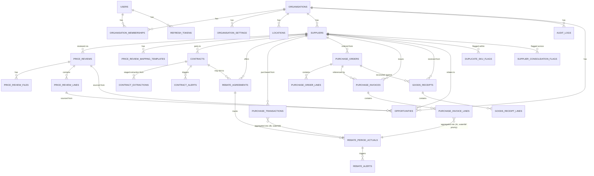

# ProcureIQ — Data Model

Conventions used throughout:
- Internal PK: `id BIGINT GENERATED ALWAYS AS IDENTITY PRIMARY KEY` (see ADR-005 — not UUID).
- External-facing identifier: `public_id UUID NOT NULL DEFAULT uuidv7() UNIQUE`.
- Every tenant-scoped table has `organisation_id BIGINT NOT NULL REFERENCES organisations(id)` and an RLS
  policy on it (see ADR-003).
- `created_at`, `updated_at TIMESTAMPTZ NOT NULL DEFAULT now()` on every table.
- Money: `NUMERIC(18,4)`. Percentages: `NUMERIC(9,6)`. Never `FLOAT`/`DOUBLE` for anything financial.
- Master data (suppliers, products, users, locations) supports soft delete via `deleted_at TIMESTAMPTZ NULL`.
- Financial fact tables (invoices, PO lines, sales facts) are **append-only** — see ADR-006. Corrections
  reference the row they correct via `corrects_id`, they never UPDATE a posted amount.

## 1. Core ERD — as actually built (migrations 0001–0009)

The diagram below reflects what's real, not the original aspirational full-spec ERD (which described
`products`, `purchase_orders`, `purchase_invoices`, `supplier_price_lists`, `inventory_snapshots`,
`sales_facts`, none of which exist — see `docs/phase2-price-review-plan.md` §2.3 and
`docs/phase4-rebate-leakage-plan.md` §7 for why those were deliberately deferred rather than built).



## 2. Phase 1 tables (built now)

### organisations
`id, public_id, name, legal_name, registration_number, tax_number, default_currency (char3),
country (char2), timezone, industry, annual_procurement_spend, fiscal_year_start (date), active bool,
created_at, updated_at`
No `settings JSONB` column for anything that feeds a calculation — see `organisation_settings` below and
ADR-004. A `branding JSONB` column is fine (logo URL, primary colour) since it never feeds a financial number.

### users
`id, public_id, first_name, last_name, email (citext, unique), password_hash, active bool, verified bool,
last_login_at, created_at, updated_at`

### organisation_memberships
`id, public_id, user_id, organisation_id, role (enum), status (enum: invited/active/suspended/removed),
invited_by_user_id, created_at, updated_at`
Unique constraint `(user_id, organisation_id)`. This table is the join that lets a consultant belong to many
orgs — see ADR-007 for how the JWT deliberately does *not* carry this whole table.

### organisation_settings
`id, organisation_id, key (text), value (jsonb), effective_from, set_by_user_id, audit_log_id,
created_at, updated_at`
Every row is a point-in-time setting value. Changing a setting inserts a new row and a matching
`audit_logs` entry — never an UPDATE to the old value. This is what makes "who changed the margin target
and when" answerable, per ADR-004.

### locations
`id, public_id, organisation_id, code, name, location_type (enum: warehouse/store/restaurant/factory/dc),
address, province, country, active, created_at, updated_at`

### audit_logs
`id, organisation_id NULLABLE (system-level actions have none), user_id, action, entity_type, entity_id,
metadata (jsonb), ip_address, created_at`
Insert-only. No UPDATE or DELETE grants on this table for the application role at all — enforced at the DB
role level, not just app logic (Section 54: "audit logs should be immutable to normal users" — made literal).

## 3. Phase 2–3 tables (master + transactional data — scaffolded now, built in later phases)

**Update:** `suppliers` is now built (see below) as part of Phase 4's price-review work, with a minimal
field set — just what the price-review workflow needs, not the full master-data CRUD this section
originally scoped. `products`/`supplier_products` remain unbuilt: Phase 2 (price review) matches products
*within* a review rather than against a global product catalog — see `docs/phase2-price-review-plan.md` §2.3.

- **suppliers** (BUILT) — `supplier_code, legal_name, trading_name, tax_number, registration_number,
  payment_terms_days, lead_time_days, minimum_order_value, currency, category, account_manager, email,
  phone, active, deleted_at`. Same field set as originally scoped here; RLS per ADR-003.

- **products** — `internal_sku, description, normalized_description, brand, category, subcategory, uom,
  pack_size, pack_quantity, net_weight, weight_uom, barcode, manufacturer, preferred_supplier_id, active,
  deleted_at`
- **supplier_products** — `supplier_id, internal_product_id, supplier_sku, supplier_description, pack_size,
  uom, moq, lead_time_days, current_price, effective_date`
- **supplier_price_lists** / **supplier_price_list_lines** — versioned by `valid_from` + `version`.
- **inventory_snapshots** — `product_id, location_id, quantity_on_hand, stock_value, average_cost,
  snapshot_date, expiry_date`.
- **sales_facts** — append-only, `product_id, location_id, quantity, selling_price, discount, net_sales,
  cost, gross_profit, gross_margin, sale_date`.
- **uploaded_files** / **import_jobs** — see Section 10/93 of the spec; `import_jobs` stores an idempotency
  key (checksum + source identifiers) to satisfy Section 93.

`purchase_orders`/`purchase_order_lines`, `purchase_invoices`/`purchase_invoice_lines`, and
`goods_receipts`/`goods_receipt_lines` were originally scoped here too — **moved to §4, now BUILT**
(Phase 4c, migration 0008) with their real field lists; removed from this section to avoid two
contradictory entries for the same tables.

## 4. Phase 4–7 tables — contracts, rebates, purchase transactions & full ledger BUILT; rest still scaffolded

- **quotations / rfqs / quotation_responses** — still scaffolded, not built.
- **contracts** (BUILT, migration 0003) — verified fields only: `supplier_id, contract_number, title,
  start_date, expiry_date, notice_period_days, auto_renew, renewal_term_months, payment_terms_days,
  currency, escalation_type, escalation_rate_pct, rebate_terms_summary, sla_terms_summary,
  minimum_spend_commitment, status, status_calculated_at` (`status` is computed, not authoritative as
  stored — ADR-010). `escalation_rate_pct` deliberately never stores a CPI/index value (ADR-009).
- **contract_extractions** (BUILT, migration 0003) — unverified AI staging per ADR-004: `contract_id`
  (nullable), `extracted_fields` (JSONB `{field: {value, confidence}}`), `verification_status`
  (`pending`/`human_verified`/`rejected` — a tri-state, not a boolean, so "nobody's looked yet" and "a
  human rejected it" are distinguishable), never joined into calculations until promoted.
- **contract_alerts** (BUILT, migration 0003) — idempotency record for the 180/90/60/30-day + notice-
  deadline alert engine (`app.analytics.contract_calculations.determine_due_alerts`).
- **rebate_agreements** (BUILT, migration 0005) — structured, calculable rebate terms, deliberately
  separate from `contracts.rebate_terms_summary` (a human-verified free-text summary, never a
  calculation input — see `docs/phase4-rebate-leakage-plan.md` §2): `supplier_id, contract_id`
  (nullable), `rebate_type, period_type, flat_rate_pct, bands` (JSONB tier list), `fixed_amount,
  currency, status`.
- **rebate_period_actuals** (BUILT, migration 0005) — one row per period: `period_start, period_end,
  actual_spend, actual_volume, entry_source` (`manual` — ADR-012 — or `transaction_aggregation` —
  Phase 4b, populated the same schema without a migration change per ADR-013), `expected_amount`
  (recalculated live), `earned_amount` (fixed at period close only), `received_amount` +
  `received_reference` (never assumed equal to earned), `status`.
- **rebate_alerts** (BUILT, migration 0005) — mirrors `contract_alerts`' idempotency pattern for the
  85%-within-30-days threshold-approaching rule.
- **purchase_transactions** (BUILT, migration 0006, Phase 4b) — minimal append-only purchase fact
  (ADR-006's correction-via-new-row pattern): `supplier_id, supplier_sku, description, transaction_date,
  amount, quantity, reference, corrects_id`. Coexists with the full ledger below via the ADR-014
  aggregation waterfall, rather than being superseded by it — see that ADR for why.
- **purchase_orders** / **purchase_order_lines** (BUILT, migration 0008, Phase 4c) — mutable, status
  workflow (`draft`/`sent`/`confirmed`/`partially_received`/`received`/`cancelled`) — not append-only,
  since a PO genuinely gets updated as it progresses (ADR-006 applies to facts, not in-flight documents).
  `supplier_id, location_id, po_number, order_date, expected_delivery_date, status, currency` /
  `supplier_sku, description, quantity_ordered, unit_price, vat_rate_pct, line_total`.
- **purchase_invoices** / **purchase_invoice_lines** (BUILT, migration 0008, Phase 4c) — append-only
  (ADR-006), correction at the header level via `corrects_id` (a whole wrong invoice is reversed, not
  individual lines): `supplier_id, purchase_order_id, invoice_number, invoice_date, corrects_id` /
  `supplier_sku, description, quantity, unit_price, discount_pct, tax_pct, net_amount`. Feeds Purchase
  Price Variance (`app.analytics.purchase_ledger_calculations.calculate_purchase_price_variance` —
  analytics-methodology.md §5's formula, documented since Phase 0, implemented in Phase 4c) and, via the
  ADR-014 waterfall, `rebate_period_actuals` aggregation with precedence over `purchase_transactions`.
- **goods_receipts** / **goods_receipt_lines** (BUILT, migration 0008, Phase 4c) — append-only,
  ordered-vs-delivered reconciliation: `supplier_id, purchase_order_id, location_id, receipt_number,
  receipt_date` / `supplier_sku, description, quantity_ordered, quantity_received` (quantity_ordered is
  copied at receipt time, not just joined via `purchase_order_line_id`, so a receipt's variance stays
  explainable — spec Section 105 — even if the PO line is later changed).
- **opportunities** (extended, migration 0009, Phase 5) — Phase 2's minimal register plus the
  five-savings-type discipline (`savings_type`, `baseline_value`, `baseline_methodology`,
  `confidence` — never blended, see `app.analytics.savings_register`), the full spec §35 waterfall
  vocabulary on `status` (DB `CHECK` constraint, not just convention), and explainability fields
  (`algorithm_version, calculation_timestamp, source_dataset_ref` — spec §105-106).
- **duplicate_sku_flags** (BUILT, migration 0009, Phase 5) — spec §107, reuses Phase 2's matching
  engine rather than a new one: `supplier_id, sku_a/description_a, sku_b/description_b,
  similarity_score, match_method, status` (`flagged`/`confirmed_duplicate`/`rejected` — human
  confirmation required, never auto-merged, same principle as product matching itself).
- **supplier_consolidation_flags** (BUILT, migration 0009, Phase 5) — spec §22, deliberately a
  flag, never an auto-generated opportunity: `supplier_a_id, supplier_b_id, description_a/b,
  similarity_score, combined_spend, status`.
- **negotiations**, **tasks**, **alerts** (generic) — still scaffolded, not built.

## 5. Row-Level Security (applies to every table above with `organisation_id`)

```sql
ALTER TABLE suppliers ENABLE ROW LEVEL SECURITY;
ALTER TABLE suppliers FORCE ROW LEVEL SECURITY;  -- ADR-011: without this, RLS does not bind to the
                                                   -- table owner, and the app's own connection was
                                                   -- the table owner from Phase 1 through Phase 3
                                                   -- until migration 0004 fixed it.
CREATE POLICY tenant_isolation ON suppliers
    USING (organisation_id = current_setting('app.current_org_id')::bigint);
```
Set once per request in the DB session dependency (`app/db/session.py`), from the validated JWT's
`active_org_id` claim — never from a client-supplied header or query param. The application connects
as `procureiq_app` (migration 0004), a role with only DML grants and never table ownership — see
ADR-011 and `docs/deployment-rls-checklist.md`.

## 6. Why append-only for financial facts (expanded from ADR-006)

`purchase_invoices`/`purchase_invoice_lines` (BUILT, Phase 4c, migration 0008) and `sales_facts` (still
unbuilt — see §4) are the source of truth for every dashboard number, every savings calculation
baseline, and every audit report. `purchase_transactions` (BUILT, Phase 4b, migration 0006) follows the
same pattern for its own, lighter-weight ledger. Both use `corrects_id` and carry no UPDATE/DELETE grant
for `procureiq_app` (ADR-011's grant discipline applied to ADR-006's design). If a row can be UPDATEd,
"what did we think the
number was on the date the opportunity was approved" becomes unanswerable — which directly breaks Section 105
(explainability) and Section 54 (auditability). A correction is a new row with `corrects_id` pointing at the
original; the original stays exactly as imported. Reporting queries sum `WHERE corrects_id IS NULL OR
corrects_id NOT IN (subquery of superseded ids)` — encapsulated in a view, not repeated inline.
